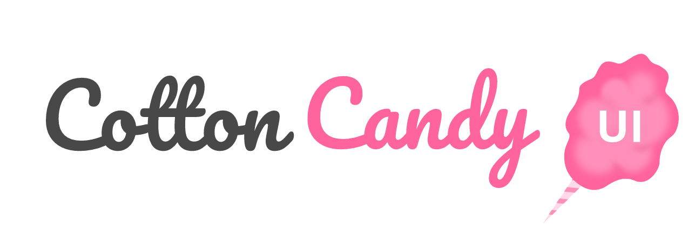

  

## 

For members learn a few about:

- best practices
- atomic design?
- react
- css-in-js
- build UI components in isolation

## Roadmap so far

- [ ] Flow to Typescript
- [ ] Update Dependencies
- [ ] Rework all components
- [ ] Create new components

## License

The source code is licensed under **MIT**. License is available [here](https://github.com/AkatsukiJS/cotton-candy-ui/blob/master/LICENSE)

##

**by Akatsuki JS**
